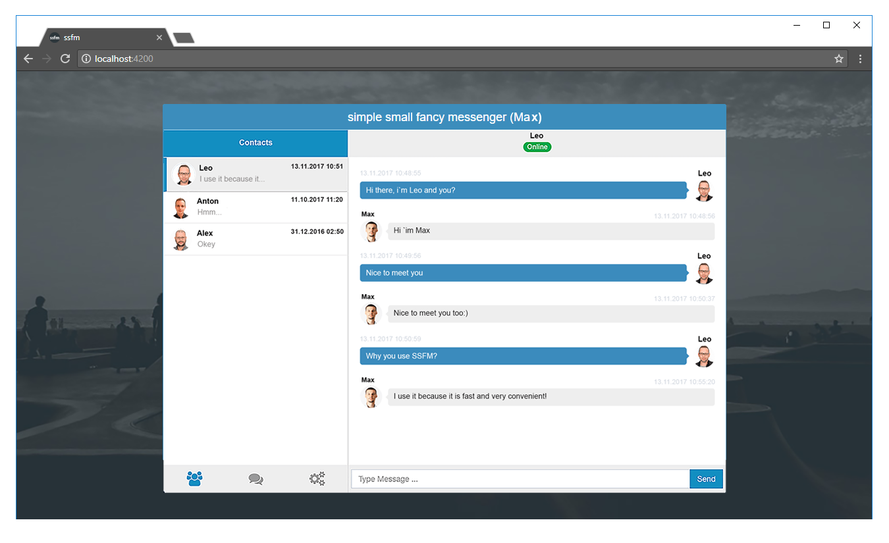
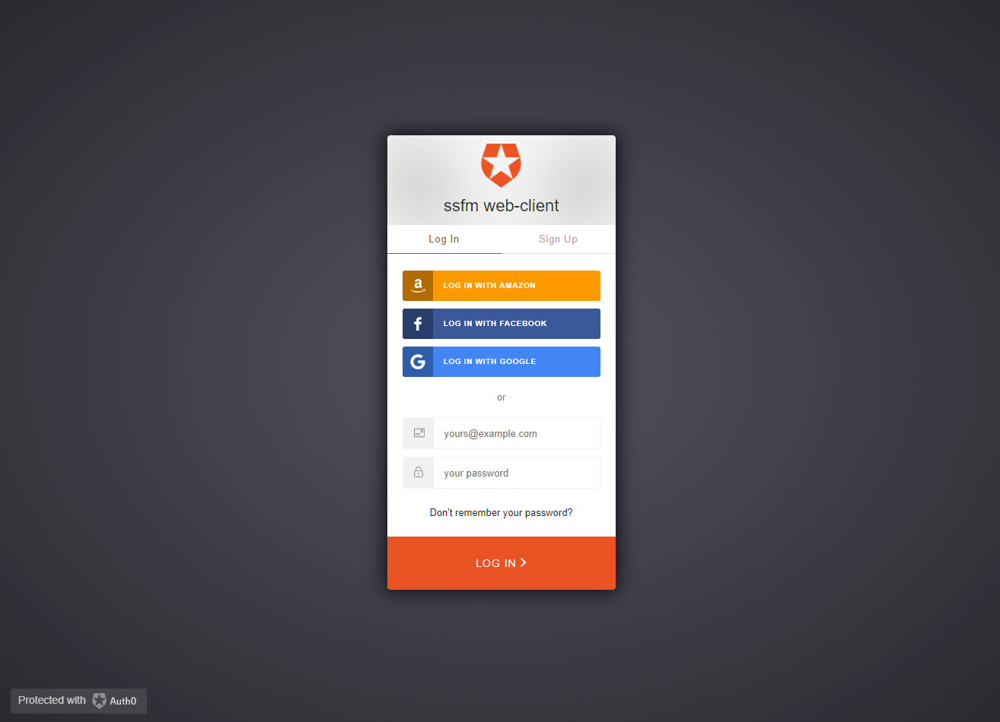
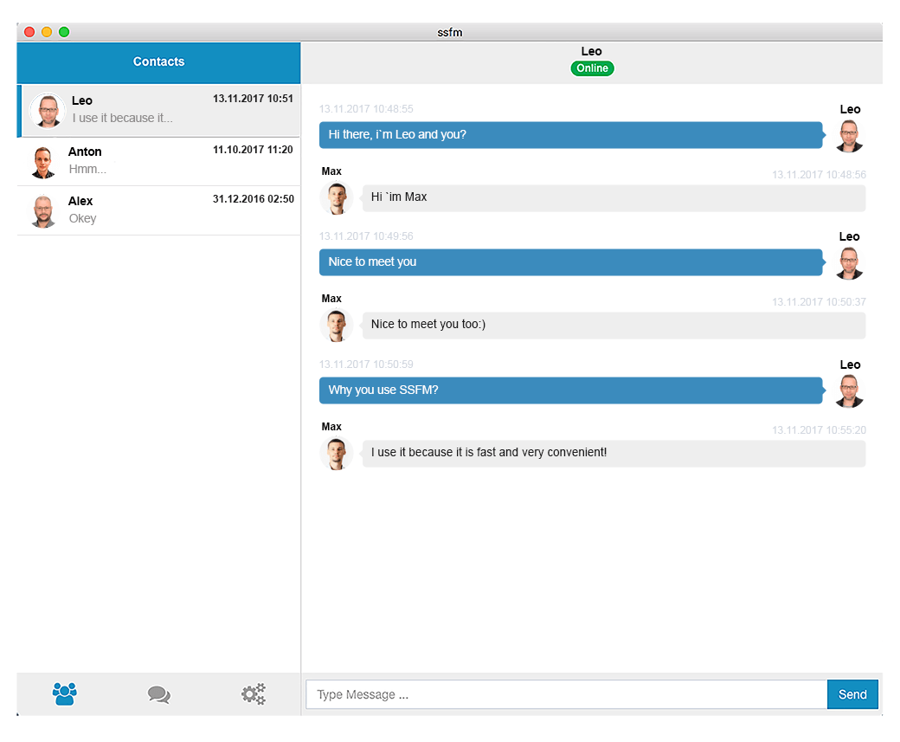
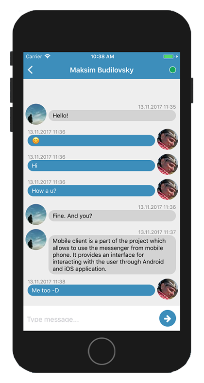
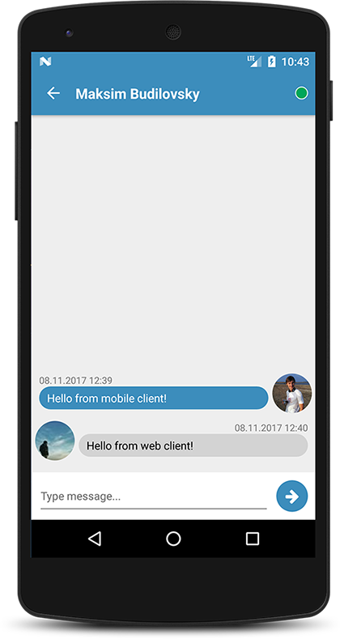
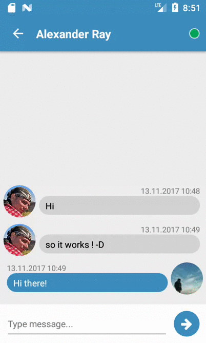

# ssfm

<p align="center">
    
    <br>
    <br>
    <b>ssfm</b> (simple small fancy messenger) is a multiplatform corporate messenger prototype.
<p>

## Structure of project

![common_architecture][common_architecture]

Project consists of the following components:

* [Application server](#application-server)
* [Proxy server](#proxy-server)
* [Web client](#web-client)
* [Desktop client](#desktop-client)
* [Mobile client (Android / iOS)](#mobile-client)

## Application server

Application server is a component dedicated to providing the processing power to handle and maintain messaging and it users.
It based on the [Play Framework][play-framework] and has been written in Scala.

Communication with clients is carried out with such technologies as:
* [Akka][akka] - free and open-source toolkit and runtime simplifying the construction of concurrent and distributed applications on the JVM;
* [WebSocket][websocket] - communication protocol which provides full-duplex communication and facilitating real-time data transfer from and to the server;
* [Circe][circe] - JSON library for Scala, which provides serialisation/deserialisation of transferred data between server and clients;

Code is located in the <a href='server'>/server</a> directory.

Core of the application server is located in the
<a href='server\web\app\controllers\chat\ChatController.scala'>\server\web\app\controllers\chat\ChatController.scala</a> file.
It is a Play controller, that that operates the messenger model with Akka actors, depending on the incoming data.

And model of the messenger is located in the
<a href='server\web\app\shared\entities\ChatModel.scala'>\server\web\app\shared\entities\ChatModel.scala</a> file.

By default Play HTTP server listens on port 9000, accordingly to this WebSocket is available at _ws://localhost:9000/api/ws/chat_
in development mode.
To change these settings, refer to the [documentation][play_documentation] for the Play framework.

To run and build service you can use this commands:
* `sbt runServer` - start server in development mode
* `sbt buildServer` - build package into the **"/server/web/target/universal/stage/bin"** directory
* `sbt runServerPackage` -  build and run server package in production mode

## Proxy server

![proxy_server][proxy_server]

Proxy server is a component that transfer serialized data between two protocols: [WebSocket][websocket] that is
used on server-side and [Socket.IO][socket_io] that is used on client-side.
It is based on [Node.js][node_js] and uses [Express][express] to listen clients.

Code consists of one service that is written in Typescript. It is located in the <a href='nodeJS-proxy'>/nodeJS-proxy</a>
directory. One part of this service connects to the Application server by WebSocket, and another part is a server,
that listens clients with Socket.IO and sends them messages from Application server. 

#### Configuring proxy server

You can customize this parameters before run or build this component:
* **PORT**: Socket.IO port at [line 9][proxy_socket_port] (this is the port used by service to listen clients)
* **WS_HOST**: WebSocket host at [line 10][proxy_ws_host] (WebSocket host of application server)
* **RECONNECT_TIMEOUT**: WebSocket reconnect timeout at [line 11][proxy_ws_timeout]
```javascript
public static PORT: number = 3000;
public static WS_HOST: string = "ws://localhost:9000/api/ws/chat";
public static RECONNECT_TIMEOUT: number = 5000;
```

To use this service first you need to [install Node.js][node_js_install] with **npm** on your computer and
run `npm install` to install npm dependencies.

#### Run and build proxy server

To run and build service you can use this commands inside the **"/nodeJS-proxy"** directory:
* `npm run build:live` or `npm start` - start service in development mode
* `rs` - restart service when it is running in development mode
* `npm run build:prod` - build package in the **"/nodeJS-proxy/dist"** directory
* `node dist/proxyService.js` - run package in production mode

Alternatively, you can use sbt commands from the project's root directory:
* `sbt runProxy` - install npm dependencies and start proxy-service in development mode
* `sbt buildProxy` - install npm dependencies and build package in the **"/nodeJS-proxy/dist"** directory
* `sbt runProxyPackage` - install npm dependencies, build and run package in production mode

## Web client

Web client is a part of the project which allows to use the messenger in browser.
It provides an interface for interacting with the user through a regular web-browser.

<p align="center">
    
<p>

Web client is based on the [Angular framework][angular] and located in the <a href='web-client'>/web-client</a> directory.

Part of the logic which is responsible for interacting with the backend (Application server) is written in [Scala.js][scalajs] and
located in the <a href='web-client/web-scalaJS'>/web-client/web-scalaJS</a> directory. Scala code compiles into
the JavaScript code, that can be used in the Angular application.

Security in web client is provided by using [Auth0][auth0] authentication service.

<p align="center">
    
<p>

#### Configuring web client

Before run or build web client you can customize host and port on which is proxy server is located and listens to Socket.IO.
It can be changed at [line 31][web_server_communication_host] of client's communication service:
```javascript
private host: string = "http://localhost:3000";
```

Also you need to configure client to use it with Auth0 API:
* Create your Auth0 account and configure it as it described at [this page][auth0_docs];
* Configure variables in [this file][web-client_auth0_config]:
    ```javascript
    clientID: 'AUTH0_CLIENT_ID',
    domain: 'AUTH0_DOMAIN',
    callbackURL: 'http://localhost:4200/callback'
    ```

#### Run and build web client

To run web client in development mode, follow this steps:
1. Compile JavaScript file from Scala.js.

    JavaScript file may compiled in two modes: **fastOptJS** and **fullOptJS**. Detailed information about this modes can be found [here][salajs-build].
    To produce a JavaScript file, run `sbt web-scalaJS/fastOptJS` or `sbt web-scalaJS/fullOptJS` from project's root directory.
    JavaScript file will be compiled in the **/web-client/src/app/scalajs** directory.
2. Specify the path to the generated Javascript file at [line 16][web_server_communication_scalajs] of client's communication service, depending on ScalaJS compile mode.
    ```javascript
    const ScalaJs = require('../scalajs/scala-js-fastopt.js');
    ```
3. Install npm dependencies with the `npm install` command from the **"/web-client"** directory.
4. Start a web server with Angular application in development mode with the `ng serve` command.
5. Navigate to `http://localhost:4200/` in your browser.

To build web client, run
```
ng build --target=production --environment=prod
```
This compiles the application into an **/web-client/dist** directory.

Alternatively, you can use sbt commands from the project's root directory.
Don't forget to [configure application](#configuring-web-client) and check [line 16][web_server_communication_scalajs] of client's communication service before run this commands.
* `sbt runWebClient` - build the Angular application and starts a web server in development mode with **fastOptJS** stage compiled Scala.js target
* `sbt buildWebClient` - build application in the **"/web-client/dist"** directory with **fullOptJS** stage compiled Scala.js target

## Desktop client

Desktop client is a part of the project which allows to use the messenger from desktop.
It provides an interface for interacting with the user through a desktop application.

<p align="center">
    
<p>

Desktop client is based on the [Angular framework][angular] and located in the <a href='desktop-client'>/desktop-client</a> directory.

It consists of two parts:
* Angular application, which will be hosted on the server;
* [Electron][electron] desktop application. Its code located in the <a href='desktop-client/main.js'>/desktop-client/main.js</a> file.
This is the entry point for Electron and defines how desktop application will react to various events performed via the desktop operating system;

Part of the logic which is responsible for interacting with the backend (Application server) is written in [Scala.js][scalajs] and
located in the <a href='desktop-client/desktop-scalaJS'>/desktop-client/desktop-scalaJS</a> directory. Scala code compiles into
the JavaScript code, that can be used in the Angular application.

Security in desktop client is provided by using [Auth0][auth0] authentication service.

<p align="center">
    
<p>

#### Configuring desktop client

Before run or build desktop client you can customize:
* Host and port on which is proxy server is located and listens to Socket.IO.
    It can be changed at [line 31][desktop_server_communication_host] of client's communication service:
    ```javascript
    private host: string = "http://localhost:3000";
    ```
* Entry point of Electron application. Change [line 19][desktop_app_entry_point] depending on which host your desktop-client is running on:
    ```javascript
    win.loadURL('http://localhost:4000');
    ```

Also you need to configure client to use it with Auth0 API:
* Create your Auth0 account and configure it as it described at [this page][auth0_docs];
* Configure variables in [this file][desktop-client_auth0_config]:
    ```javascript
    clientID: 'AUTH0_CLIENT_ID',
    domain: 'AUTH0_DOMAIN',
    callbackURL: 'http://localhost:4000/callback'
    ```

#### Run and build desktop client

To run desktop client in development mode, follow this steps:
1. Compile JavaScript file from Scala.js.

    JavaScript file may compiled in two modes: **fastOptJS** and **fullOptJS**. Detailed information about this modes can be found [here][salajs-build].
    To produce a JavaScript file, run `sbt desktop-scalaJS/fastOptJS` or `sbt desktop-scalaJS/fullOptJS` from project's root directory.
    JavaScript file will be compiled in the **/desktop-client/src/app/scalajs** directory.
2. Specify the path to the generated Javascript file at [line 16][desktop_server_communication_scalajs] of client's communication service, depending on ScalaJS compile mode.

    ```javascript
    const ScalaJs = require('../scalajs/scala-js-fastopt.js');
    ```
3. Install npm dependencies with the `npm install` command from the **"/desktop-client"** directory.
4. Start a web server with Angular application in development mode with the `ng serve` command.
5. Run `electron .` command to open desktop application

To build desktop client, run `ng build --target=production --environment=prod`. This compiles the Angular application into an **/desktop-client/dist** directory.
To build desktop app, run `npm run build`. The generated apps can be found under **"/desktop-client/app-dist"**.

Alternatively, you can use sbt commands from the project's root directory.
Don't forget to [configure application](#configuring-desktop-client) and check [line 16][desktop_server_communication_scalajs] of client's communication service before use this commands.
* `sbt runDesktopClient` - builds the Angular application and starts a web server in development mode with **fastOptJS** stage compiled Scala.js target
* `sbt runDesktopApp` - run Electron desktop application
* `sbt buildDesktopClient` - build Angular application in the **"/desktop-client/dist"** directory with **fullOptJS** stage compiled Scala.js target
* `sbt buildDesktopApp` - build desktop applications in **"/desktop-client/app-dist"**

## Mobile client

Mobile client is a part of the project which allows to use the messenger from mobile phone.
It provides an interface for interacting with the user through Android and iOS application.

<p align="center">
  
  
<p>
<p align="center">
  
<p>

Mobile client is based on the [React Native][react-native] and located in the <a href='mobile-client'>/mobile-client</a> directory.

Part of the logic which is responsible for interacting with the backend (Application server) is written in [Scala.js][scalajs] and
located in the <a href='mobile-client/mobile-scalaJS'>/mobile-client/mobile-scalaJS</a> directory. Scala code compiles into
the JavaScript code, that can be used in the React Native application.

#### Configuring mobile client

Before run or build mobile client you can customize host and port on which is proxy server is located and listens to Socket.IO.
It can be changed at [lines 4 and 5 of configuration file][mobile_server_communication_host]:
```javascript
    proxyHost: 'http://localhost',
    proxyPort: 3000
```

Also you need to configure client to use it with Auth0 API:
* Create your Auth0 account and configure it as it described at [Auth0 documentation][auth0_docs];
* Configure variables in [this file][mobile-client_auth0_config]:
    ```javascript
    auth0domain: 'AUTH0_DOMAIN',
    auth0clientId: 'AUTH0_CLIENT_ID',
    ```

#### Run and build mobile client

To run mobile client on simulator in development mode, follow this steps:

* Compile JavaScript file from Scala.js.
    JavaScript file may compiled in two modes: **fastOptJS** and **fullOptJS**. Detailed information about this modes can be found [here][salajs-build].
    To produce a JavaScript file, run `sbt mobile-scalaJS/fastOptJS` or `sbt mobile-scalaJS/fullOptJS` from project's root directory.
    JavaScript file will be compiled in the **/mobile-client/app/services/scalaJS** directory.
* Specify the path to the generated Javascript file at [line 8][mobile_server_communication_scalajs] of client's communication service, depending on ScalaJS compile mode.
  
    ```javascript
      const scalaJS = require('./scalaJS/scala-js-fastopt.js');
    ```
* Install the required dependencies as it described [here][react-native_dependencies];
* Run `npm install` from **"/mobile-client"** directory to install npm dependencies;
* Then, depending on the platform used:
    * Android:
        * Open Android emulator. For detailed information see [Android Studio user guide][start_android_emulator];
        * Run `react-native run-android` to start Android application on emulator.
    * iOS:
        * Open iOS simulator
        * Run `react-native run-ios` to start iOS application. See [React Native documentation][react-native_iOS_simulator] for more information;
        
Also you can run application on real devices. See [this document][react-native_run_on_device] for the information;

To generate the release APK for Android (see [this info][react-native_build_android] for more details):
* Get or generate your signing key (see [this document][android_signing]) and put it under the <a href='mobile-client/android/app'>/mobile-client/android/app</a> directory.
* Fill **signingConfigs** section in [Gradle config file][android_gradle_config] with the correct keystore password, alias and key password.
* Run the `gradlew assembleRelease` command from **"/mobile-client"** directory. The generated APK can be found under **mobile-client/android/app/build/outputs/apk/app-release.apk**, and is ready to be distributed.

To build client release for iOS (see [this info][react-native_build_iOS] for more details):
* To configure your app to be built using the Release scheme, go to **Product → Scheme → Edit Scheme** in Xcode. Select the **Run** tab in the sidebar, then set the Build Configuration dropdown to *Release*.
* Build your app for release by tapping **⌘B** or selecting **Product → Build** from the menu bar. You can also run `react-native run-ios --configuration Release`.

Alternatively, you can use sbt commands from the project's root directory,
Don't forget to [configure application](#configuring-mobile-client) and check [line 8][mobile_server_communication_scalajs] of client's communication service before use this commands.
* `sbt runAndroidMobileClient` - install npm dependencies and run Android application in development mode with **fastOptJS** stage compiled Scala.js target (start Android emulator before using this command)
* `sbt runIosMobileClient` - install npm dependencies and run iOS application in development mode with **fastOptJS** stage compiled Scala.js target (start iOS simulator before using this command)
* `sbt buildAndroidMobileClient` - generates the release APK for Android in **mobile-client/android/app/build/outputs/apk/app-release.apk**. Don't forget to put your signing key under the <a href='mobile-client/android/app'>/mobile-client/android/app</a> directory before build.
* `sbt buildIosMobileClient` - build iOS mobile app for release. Before run this command configure release scheme in Xcode (go to **Product → Scheme → Edit Scheme**. Select the **Run** tab in the sidebar, then set the Build Configuration dropdown to *Release*) 

## sbt commands:

#### Run projects in dev mode:

* `sbt runAll` - Run all projects in dev mode. Install necessary dependencies, check parameters and configuration files of all projects, and run Android or/and iOS simulator before running this command.
Note that the desktop-app needs to be reload with _Ctrl+R_ after desktop-client starting.
* `sbt runServer` - Start server in development mode.
* `sbt runProxy` - Start proxy-service in development mode.
* `sbt runWebClient` - Starts a server with web client in development mode.
* `sbt runDesktopClient` - Starts a server with desktop client in development mode.
* `sbt runDesktopApp` - Run Electron desktop application.
* `sbt runAndroidMobileClient` - Run Android application in development mode.
* `sbt runIosMobileClient` - Run iOS application in development mode.

#### Distributing projects:

* `sbt buildAll` - Build all projects. Install necessary dependencies, check parameters and configuration files of all projects before running this command.
Also check that your Android app has the signing key under <a href='mobile-client/android/app'>/mobile-client/android/app</a>
and you have configured release scheme in Xcode for iOS app.
* `sbt buildServer` - Build server package into the **"/server/web/target/universal/stage/bin"** directory.
* `sbt buildProxy` - Build proxy server package in the **"/nodeJS-proxy/dist"** directory.
* `sbt buildWebClient` - Build web client in the **"/web-client/dist"** directory.
* `sbt buildDesktopClient` - Build desktop client in the **"/desktop-client/dist"**.
* `sbt buildDesktopApp` - Build desktop applications in **"/desktop-client/app-dist"**.
* `sbt buildAndroidMobileClient` - Generates the release APK for Android in **mobile-client/android/app/build/outputs/apk/app-release.apk**.
* `sbt buildIosMobileClient` - Build iOS mobile app for release.

#### Run distributed projects

* `sbt runServerPackage` - Build and run server package in production mode.
* `sbt runProxyPackage` - Build and run proxy server package in production mode.

## Issues and tasks

- `runServer` runs server with Scala.js fastOpt stage (affects the Play front-end)
- create screenshots for web client
- clean server from front-end
- clean clients from Auth0
- check `buildWebClient` и `buildDesktopClient`. It stuck on `92% chunk asset optimization` stage.

[common_architecture]: res/readme/common_architecture.jpg
[play-framework]: https://www.playframework.com
[akka]: https://akka.io
[websocket]: https://github.com/websockets/ws
[circe]: https://circe.github.io/circe
[play_documentation]: https://www.playframework.com/documentation
[proxy_server]: res/readme/proxy_server.jpg
[socket_io]: https://socket.io
[node_js]: https://nodejs.org
[express]: http://expressjs.com
[proxy_socket_port]: nodeJS-proxy/src/proxyService.ts#L9
[proxy_ws_host]: nodeJS-proxy/src/proxyService.ts#L10
[proxy_ws_timeout]: nodeJS-proxy/src/proxyService.ts#L11
[node_js_install]: https://nodejs.org/en/download
[angular]: https://angular.io
[scalajs]: https://www.scala-js.org
[auth0]: https://auth0.com
[web_server_communication_host]: web-client/src/app/providers/communication.service.ts#L31
[auth0_docs]: https://auth0.com/docs/clients
[web-client_auth0_config]: web-client/src/app/providers/auth/auth0-variables.ts#L8
[salajs-build]: https://www.scala-js.org/doc/project/building.html
[web_server_communication_scalajs]: web-client/src/app/providers/communication.service.ts#L16
[electron]: https://electron.atom.io
[desktop_server_communication_host]: desktop-client/src/app/providers/communication.service.ts#L31
[desktop_app_entry_point]: desktop-client/main.js#L19
[desktop-client_auth0_config]: desktop-client/src/app/providers/auth/auth0-variables.ts#L8
[desktop_server_communication_scalajs]: desktop-client/src/app/providers/communication.service.ts#L16
[react-native]: https://facebook.github.io/react-native
[mobile_server_communication_host]: mobile-client/app.config.js#L4
[mobile-client_auth0_config]: mobile-client/app.config.js#L2
[mobile_server_communication_scalajs]: mobile-client/app/services/communicationService.js#L8
[start_android_emulator]: https://developer.android.com/studio/run/managing-avds.html
[react-native_dependencies]: http://facebook.github.io/react-native/docs/getting-started.html#installing-dependencies
[react-native_iOS_simulator]: http://facebook.github.io/react-native/docs/running-on-simulator-ios.html
[react-native_run_on_device]: http://facebook.github.io/react-native/docs/running-on-device.html
[react-native_build_android]: https://facebook.github.io/react-native/docs/signed-apk-android.html
[android_signing]: https://developer.android.com/studio/publish/app-signing.html
[android_gradle_config]: mobile-client/android/app/build.gradle#L114
[react-native_build_iOS]: https://facebook.github.io/react-native/docs/running-on-device.html#building-your-app-for-production
